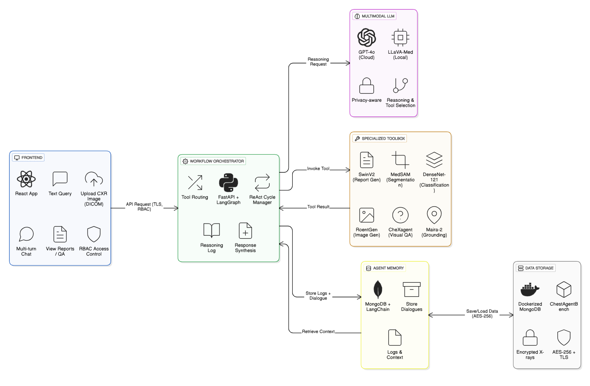

# MediVision-G469-PS25

# MediVision-Multimodal AI for Real-Time Chest X-ray Diagnosis

# 📝 Abstract

MediVision is an intelligent, agentic system designed to assist clinicians or radiologists in interpreting chest X-rays (CXRs) through natural language queries and multimodal reasoning. Built on a privacy-conscious architecture, it integrates a powerful multimodal LLM (GPT-4o or LLaVA-Med) with a suite of specialized tools such as MedSAM, CheXagent, RoentGen, and DenseNet-121 to perform segmentation, classification, visual question answering, and report generation.

Using the ReAct agent workflow, MediVision dynamically selects and orchestrates tools to handle complex, multi-step clinical queries. It supports memory-aware interactions through LangChain and offers secure, HIPAA-compliant storage via Dockerized MongoDB. The system is tested using ChestAgentBench—a benchmark of 2,500 curated queries—demonstrating strong performance in diagnosis, localization, and visual explanation tasks.

MediVision improves diagnostic efficiency, supports medical education, and enables transparent, real-time AI assistance in clinical workflows, making it a valuable tool in modern healthcare settings.

# 🔑 Key Features
👨‍⚕️ **Intelligent Agent for Chest X-ray Analysis**
- Combines multiple AI models for segmentation, classification, report generation, and visual question answering (VQA).

🧠 **Multimodal Reasoning with LLMs**  
- Supports both image and text understanding using GPT-4o or LLaVA-Med, enabling complex medical queries and decision-making.

🔄 **ReAct-based Agentic Workflow**    
- Uses Reason-Act-Observe loop to perform step-by-step clinical reasoning with real-time tool orchestration.

🧰  **Modular AI Toolbox**  
- Includes MedSAM, CheXagent, Maira-2, DenseNet121, RoentGen, SwinV2, etc. for domain-specific medical tasks.

💬 **Memory-Enabled Multi-Turn Dialogues**  
- Uses LangChain and MongoDB to retain query history and enhance explainability.

🔐 **Privacy and Security Focused**  
- HIPAA-compliant design with secure Dockerized MongoDB, TLS encryption, and RBAC-based access control.

⚙️ **Scalable Backend**  
- FastAPI and LangGraph provide real-time orchestration and workflow control.

🧪 **Benchmarked with ChestAgentBench**
- Evaluated using a clinical benchmark of 2,500 expert queries across 7 diagnostic categories.

# 🧱 Architecture

## 🛠️ Tech Stack

⚛️ **Frontend**:  
- React.js (MERN stack)  

⚡**Backend**:
- FastAPI (for orchestration and ReAct loop)  

🛢 **Database**:  
- MongoDB (Dockerized)  
- LangChain (for memory/context)  

🤖 **AI & ML Models**:  
- GPT-4o / LLaVA-Med (Multimodal LLM)  
- MedSAM (Segmentation)  
- CheXagent (Visual Question Answering)  
- RoentGen (X-ray Generation)  
- SwinV2 (Report Generation)  
- DenseNet-121 (Pathology Classification)  
- Maira-2 (Grounding)  

⚙️ **Tools & Frameworks**:  
- LangGraph (Workflow Orchestration)  
- Docker  
- DICOM Processor  
- ChestAgentBench Dataset  

## 👥 Target Users

- **🩺 Doctors / Radiologists**  
  Use the system to analyze chest X-rays quickly and accurately with AI support.

- **🏥 Clinicians (ER, Pulmonologists, etc.)**  
  Get real-time assistance during diagnosis and clinical decision-making.

- **🎓 Medical Students / Trainees**  
  Learn diagnostic reasoning through visual explanations and interactive queries.

- **🛠️ Admins / IT Integrators**  
  Manage access control (RBAC), system security, and deployment in hospital infrastructure.

- **🔬 Researchers**  
  Study and improve AI clinical reasoning, tool orchestration, and evaluation benchmarks.

- **👨‍👩‍👧‍👦 Patients (Optional)**  
  Benefit from faster and more accurate radiology reports and diagnoses.

  
## ❓ Justification for using Agentic Workflows 

- **🏥 Handles Complex Medical Tasks**  
   Agentic workflows break down the task and handle each step one by one.

- **🔧 Combines Multiple Tools Automatically**  
   Instead of using one tool for everything, the agent decides which tools to use and when.

- **💯 Improves Accuracy and Flexibility**  
   The agent plans a reasoning path based on the specific question, improving clinical relevance.

- **🧠 Mimics Clinical Thinking**  
   Doctors think step-by-step: *“What’s the finding? Where is it? Has it changed?”*  

- **🔍 Enables New Use Cases**  
   Supports advanced comparisons like evaluating two X-rays over time, detecting subtle changes.

## 🤝 Contributors
- [@Akshaya05-code](https://github.com/Akshaya05-code) - Kadari Akshaya
- [@pranavi-code](https://github.com/pranavi-code) - Ginnareddy Pranavi Reddy
- [@gouniaksharareddy](https://github.com/gouniaksharareddy) - Gouni Akshara Reddy
- [@Tejaswi-g](https://github.com/Tejaswi-g) - Gillella Tejaswi
- [@guntishivani](https://github.com/guntishivani) - Gunti Shivani
